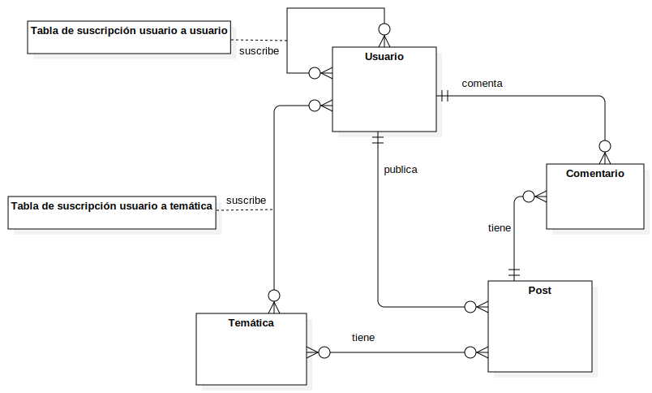

# EL RINCÓN DEL SOFTWARE

## ÍNDICE

- [Tipos de Usuario](#-tipos-de-usuario)
- [Entidades](#-entidades)
- [Imágenes](#-imágenes)
- [Gráficos](#-gráficos)
- [Tecnologías complementarias](#-tecnologías-complementarias)
- [Algoritmos avanzados](#-algoritmos-avanzados)
- [Colaboradores](#-colaboradores)

### Descripción general

El rincón del software es una aplicación web que trata de servir como un espacio colaborativo donde los usuarios puedan compartir sus experencias, preguntar dudas o debatir sobre temas relacionados con el software. La aplicación trata de ofrecer la mejor experiencia al usuario mostrando recomendaciones, tendencias o manteniéndole informado de las novedades.

### 👤 Tipos de Usuario

La aplicación tendrá diferentes tipos de usuarios: no registrados, registrados y administradores.

Los usuarios no registrados podrán acceder al foro , ver los posts y enviar mensajes directamente a los administradores.

Los usuarios registrados, además de acceder al foro, podrán publicar contenido.

Los administradores podrán  editar temáticas, banear usuarios, eliminar posts y emplear LLM para la autogeneración de post.

### 🔑 Entidades 

La aplicación tendrá diferentes tipos de entidades: usuarios, temáticas, posts, comentarios.

### 🌄 Imágenes

La aplicación tendrá la opción de subir imágenes en los posts como parte del contenido. 

### 📊 Gráficos

La aplicación tendrá gráficos de tendencias sobre las temáticas con más publicaciones en un periódo de tiempo.

### 🔮 Tecnologías complementarias

La aplicación  dispondrá de un LLM local para la autogeneración de post.

### 🔧 Algoritmos avanzados

-Por definir-

### 👥 Colaboradores

| Nombre | Email | Github |
| --------------------------- | --------------------------------- | --------------------------------------------------- |
| Sergio Villagarcía Sánchez | s.villagarcia.2019@alumnos.urjc.es | [Sergio-1502](https://github.com/Sergio-1502)                 |
| Adrián Morales Dato | a.morales.2019@alumnos.urjc.es | [Adri-md-1208](https://github.com/Adri-md-1208)                 |
| Nicolás Rubira Cabello | n.rubira.2019@alumnos.urjc.es | [nicorubira](https://github.com/nicorubira)                  |
| Jesús González Gironda | j.gironda.2019@alumnos.urjc.es | [ggronda](https://github.com/ggronda) |
